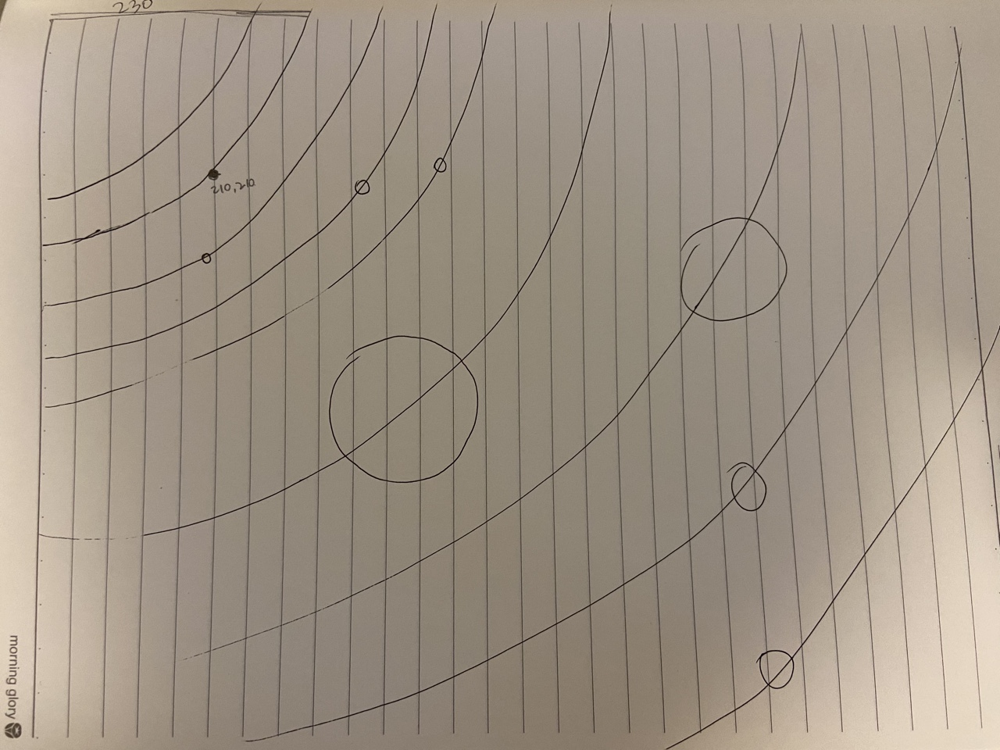
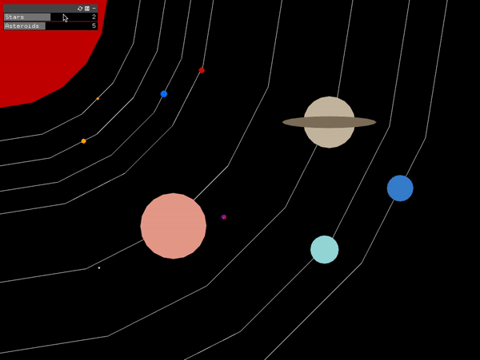
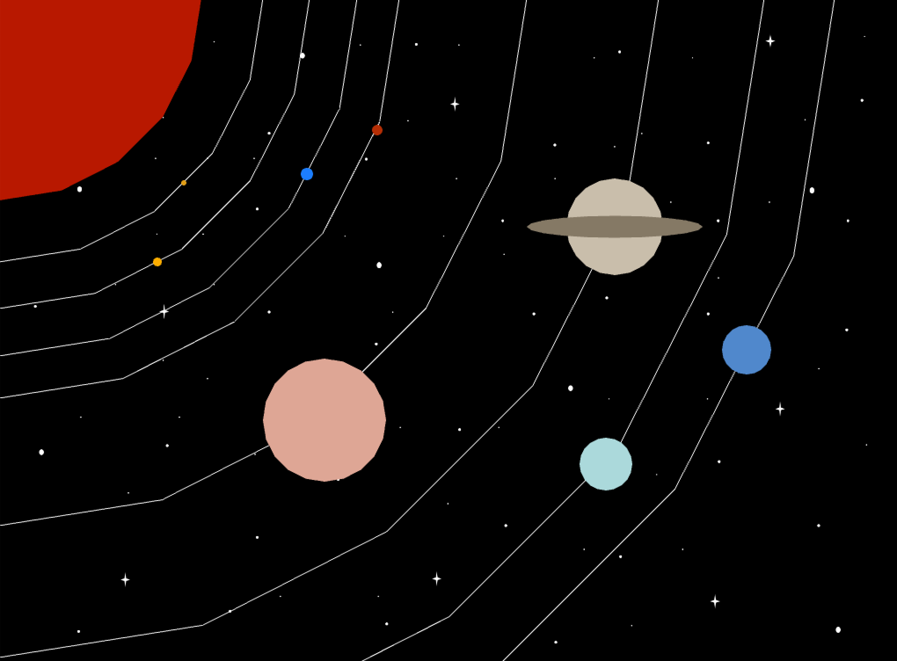

## Assignment 1 - Still ##

## Title: Our Solar System  

We were told to create a series of still images. I wanted to apply what I have learned until week 3. Since I felt that the functions for drawing shapes in openFrameworks was kind of different from what I have learned in other forms of programming languages, I wanted to utilize and get used to drawing 2D shapes (also known as the basics of the basics). 

### Ideation

The idea stemmed from myself wanting to depict the beauty of the space in the graphic world. I have always thought of the patterns and visible regularities that the space and our solar system portrays as extremely fascinating. Since the solar system is a sequence of repetition of circles, smaller circles, and larger circles, I thought that is creates a pattern. Therefore, I wanted to model the beauty of the space and our solar system.

**Below is the blueprint :**


**Below is the still image of final art :**


**Below is the gif of final project :**



### Shapes

I found that the solar system is consisted of different planets and the sun; thus, it was relatively easy for me to draw and figure out the blueprint of the solar system. I placed the Sun in the upper left corner and placed the following planets in order. I noticed that the circles do not turn out as perfect circles, but rather with angular lines. However, I thought that this might better depict the characteristics of graphic art. After placing the planets, I moved on to drawing the orbital lines as well to give a better sense of 'solar system'. 

### Color
I used the real solar system image as a reference to pick the colors for each of the planets. To give the space-vibe, I first chose the background as all black (0,0,0). 


### Rules
The rules are, obviously, the order of the planets and the comparison between their sizes. It surprised me a lot in that the size of the planets vary dramatically. Even the Earth that we live right now seems very huge; I cannot even imagine how huge the Jupiter and the Sun will be. 
There are two Gui in the code: both for IntSlider.
The first gui is for controlling the radius of the stars that randomly appear on the screen.
The second gui is for controlling the radius of the asteroids that randomly appear on the screen.


## Process & Challenges

### 1. Coming up with an idea 

It was difficult for me to come up with an idea. 

### 2. Background


Originally, I decided to insert the image as the background. I started drawing the image with Powerpoint. I used https://openframeworks.cc/learning/02_graphics/how_to_load_and_display_an_image/ this source as a reference. However, another problem happened! The image would appear with a blue hue (tint) even if there is no blue hue at all. I searched on Google, and I came up with this source: https://forum.openframeworks.cc/t/ofimage-from-gif-displays-with-blue-tint/22989 . Thankfully, it worked: adding the below code in the draw() function.

```
ofSetColor(255, 255, 255, 255);
```
**Below is the demo for this art with background image: **



However, I decided to change the code into scattering random stars using for loops with the help of Gui. 
I added two intSlider guis: one for stars, and the other one for asteroids.

### 3. Placing planets and orbital circles 

It was difficult for me to draw the circles as where I intended them to be. 
I realized that it is much easier if the orbital circles are drawn first. 
In order to give the effect that the planet is in front of the orbital circles, I first wrote the orbital circles code and then wrote the planet code later.


## Evaluation & Reflection 

Although I have faced challenges throughout the process, overall, it was very fun. 
It really fascinated me that the beautiful artwork can be generated through graphic programming. 
There are still some unsatisfactory parts:
- I wish there were some more patterns and details in each planets; the single-colored planets does not seem to fully portray the beauty of the space.
- Next time, I want to make the code in a more concise way (not having to write each of the planets one by one)


