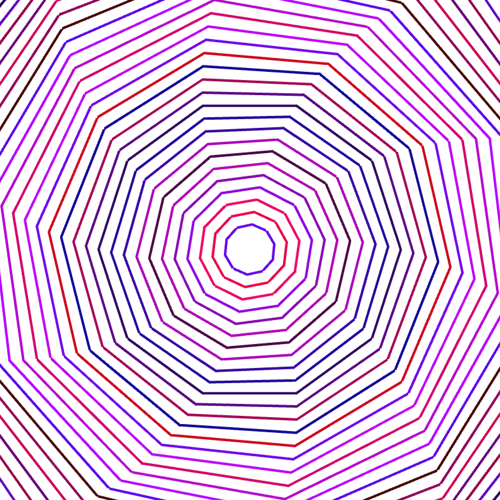
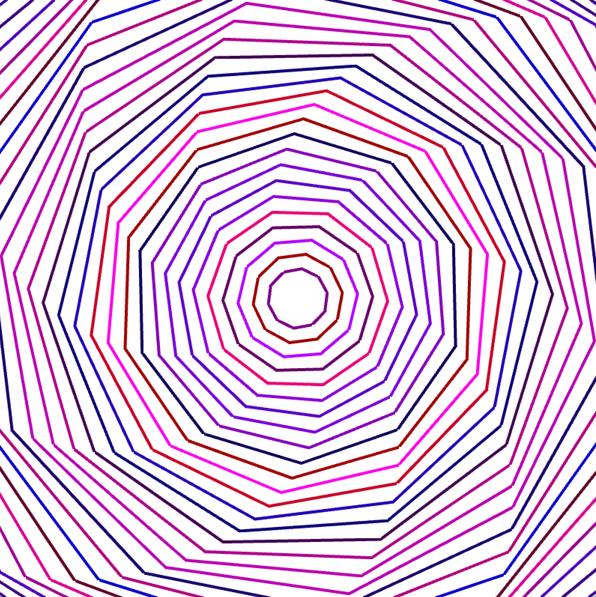
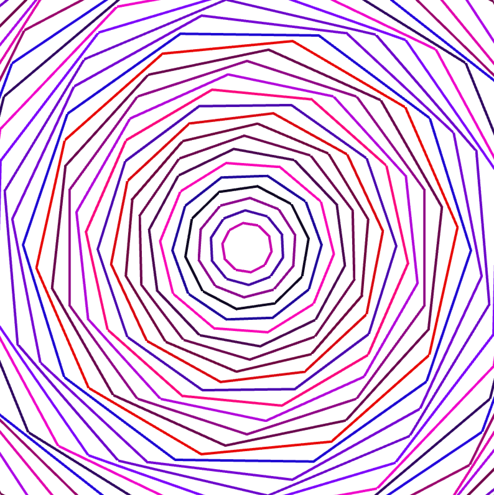
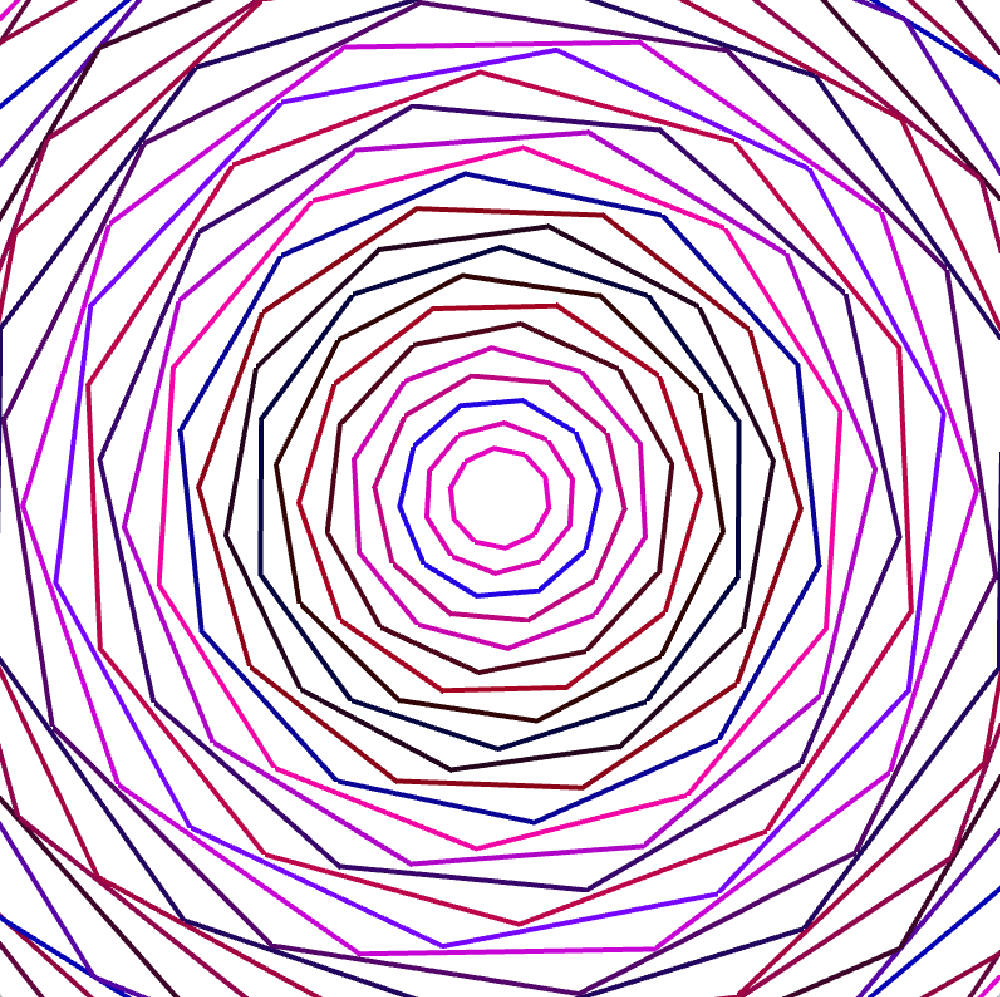

# Riley Ha Assignment 2 - Motion

## Swirl

**1) Ideation** <br> 
I got my idea from the previous assignment related to motion animation. 
I mentioned earlier that I wish to further implement different rotate techniques to enhance my previous assignment ('Order inside Chaos').
One thing that inspired me the most was the concept of white hole (yes, the opposite of black holes).
I intended to create a hypnotizing effect - the more you look at it, the more you will feel hypnotized!

**2) Process & Challenges** <br>
I wanted to apply the previous lessons (tutorials) into my unique style. 
Following are the processes (and the challenges that followed). 

- Instead of just one hue from RGB, I intended to add random colors for the line strokes.
```
    int time = ofGetSystemTimeMillis()/10;
    ofSetColor(ofRandom(255), time%10, ofRandom(255));

```
- I also wished to add swirling effect. I think I only had a brief knowledge about ofRotate() function. Thus, I did some research. 
  - https://openframeworks.cc/documentation/graphics/ofGraphics/#show_ofRotateYDeg
- While using ofRotate() function, I wanted to give an effect that the shape was rotating from its center.
  - This[https://stackoverflow.com/questions/12516550/openframeworks-rotate-an-image-from-its-center-through-opengl-calls] website explained!
- Making my own shape was another big challenge for me. 
  - ofBeginShape[http://openframeworks.kr/documentation/graphics/ofGraphics.html#!show_ofBeginShape]
  - ofEndShape[http://openframeworks.kr/documentation/graphics/ofGraphics.html#!show_ofEndShape]
  - It was a new discovery that ofEndShape gets boolean as input.
```
void ofApp::drawShape(int radius){
    
    int degSpan = 36;
    
    ofBeginShape();
    
    for (int deg = 0; deg < 360; deg += degSpan){
        
        ofVertex(ofPoint(radius * cos(deg * DEG_TO_RAD), radius * sin(deg * DEG_TO_RAD)));
    }
    
    ofEndShape(true);
}

```

**3) Reflection** <br>
1) Next time, I wish to add Gui or a device in which the users can change the color. (a.k.a I wish to make an interactive project)
2) I think I learned a lot (from various functions to effects) overall. It was quite fun!

**4) Result** <br>
Below is the result of my project.

*Still Images* <br>
{:height="50%" width="50%"}
- Right after starting program <br>

{:height="50%" width="50%"}
- After 5 seconds <br>

{:height="50%" width="50%"}
- After 10 seconds <br>

{:height="50%" width="50%"}
- After 15 seconds <br>


*GIF File* <br>


*Youtube Link* <br>

**5) Useful sources** <br>

http://openframeworks.kr/doxygen/annotated.html
