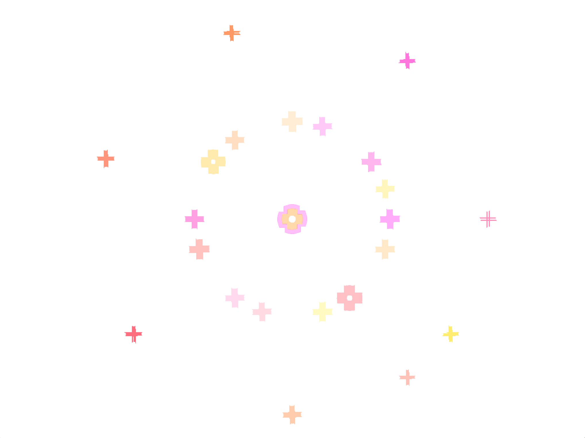
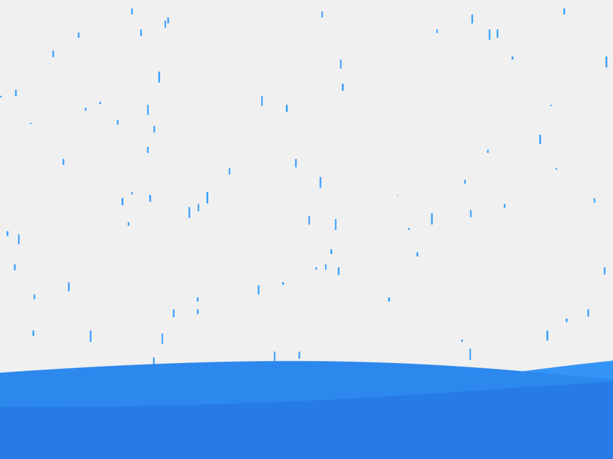
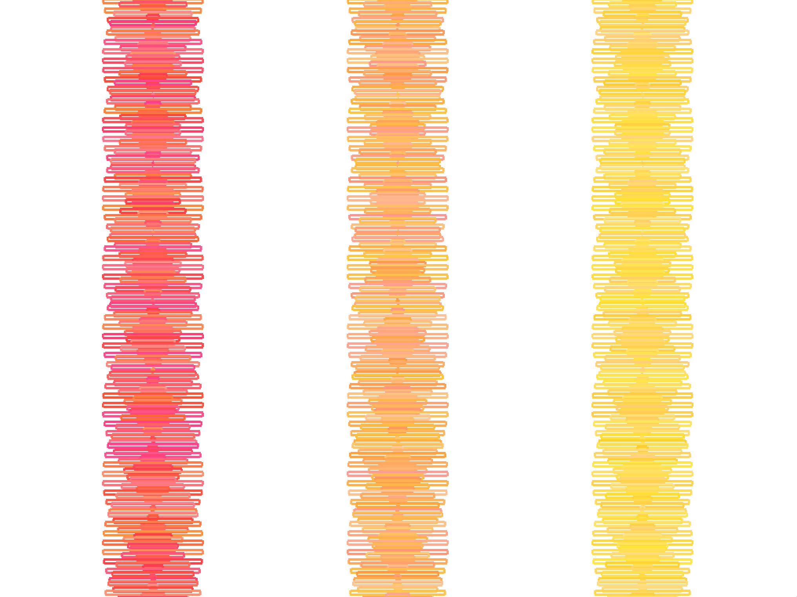
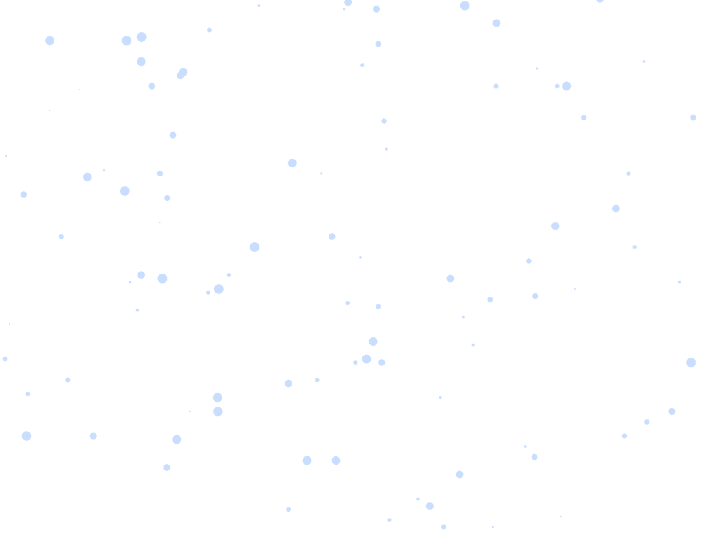

## Assignment 3 ##

## Title: Four Seasons  

For this week, we were told to create a piece of software art with storytelling. 

## Demo
**Youtube Link**


**Still Images**


- Spring

- Summer

- Fall

- Winter

## Process

### 1. Ideation & Inspiration

It took a long time for me to come up with an idea. I got the idea from Vivaldi's four seasons. 

Korea, my country, is famous for the four very distinct seasons. 
Since I have always enjoyed listening to the song, I wanted to depict the images that come to my head about the four seasons.
Thus, I decided to make four different animations according to each season.

### 2. Spring

For spring, I decided to apply... 
1) ofTranslate
2) ofRotateDeg
3) ofGetSystemTimeMillis() / 100
4) New circle that appears after every 4 seconds

### 3. Summer

For summer, I wished to apply the concepts of...
1) push_back 
  - [This](http://sfpc.io/BeginningCodersBootcamp/2019-09/) source and
  - [This](https://youtu.be/ELEL8CAdVHY?list=PL4neAtv21WOmrV8z9rSzL20QpdLU1zJLr) source helped a lot.
2) Loading and displaying an image
  - [Reference](https://openframeworks.cc/learning/02_graphics/how_to_load_and_display_an_image/)

### 4. Fall

For fall, I wished to apply [this video](https://youtu.be/1eKr0KZBmjY) in my own style.
Because I thought that the rectangles resemble fallen leaves, I wanted to create 3 separate bands of fallen leaves that appear as time passes.
```
ofDrawRectangle(ofGetWidth()/2, i*4, sin(i + ofGetElapsedTimef())*128, 5);
```

### 5. Winter

For winter theme, I wanted to add an interactive effect: the direction of the falling snows follow the player's mouseX position.
```
        ofDrawCircle(snow[i].x + (mouseX/10), snow[i].y, ofRandom(1,7));

```

## Evaluation & Reflection 
### Evaluation
I personally enjoyed this assignment very much. I found myself being more and more ambitious about adding new features to the animation. 
Though I had some hard time in thinking of ideas for 4 separate animations, I feel that I made much more usage of the built in functions and applications than before.

### Reflection
There are some points that I would like to improve further.
1) I wish I added more interactive element (ex. Gui, MousePressed, etc.)
2) Piling up the rain and snow
3) Using mesh
