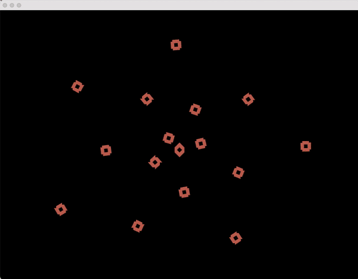

# Riley Ha Weekly Assignment - Order inside Chaos

## openFrameworks app (sketch) that makes a cyclical animation

**1) Ideation** <br> 
Since I missed the previous class due to condition difficulties, it was hard for me to catch up with the class materials. Thus, I watched a lot of youtube videos as reference.
One thing that inspired me the most was [This](https://www.youtube.com/watch?v=5N12MPK1aC4) video. 
According to the instructions, below are few images that I got after the aforementioned tutorial.

*Still Images* <br>


*GIF Image* <br>




**2) Process** <br>
I wanted to apply this tutorial into my unique style. 
- Instead of just one hue from RGB, I intended to add random colors from all range of RGB.
```
    ofSetColor(time % 10, ofRandom(255), ofRandom(255));
    ofSetColor(ofRandom(255), time % 10, ofRandom(255));
    ofSetColor(ofRandom(255), ofRandom(255), time % 10);

```
- I also wished to add new shapes other than rectangles.
```
    for (int k=0; k<500; k+=50){
        ofSetLineWidth(5);
        ofSetColor(ofRandom(255), time%10, ofRandom(255));
        ofDrawCircle(k, 0, 20);
        ofRotateDeg(time% 360);
    }
    
    for (int j=0; j<600; j+=50){
        ofSetLineWidth(2);
        ofSetColor(ofRandom(255), ofRandom(255), time%10);
        ofDrawCircle(j, 0, 10);
        ofRotateDeg(time% 360);
    }
```

**3) Improvements** <br>
1) I feel that my assignment seems kind of basic and tutorial based. Next time, by incorporating more shapes, I would like to create a more diverse and sophisticated geometric pattern. 
2) I also wish to learn more animation effects other than just rotation. 
- Wave, Resizing, etc.

**4) Result** <br>
Below is the result of my project.

*GIF File* <br>


*Youtube Link* <br>

https://youtu.be/D3mOuP-h0MA

