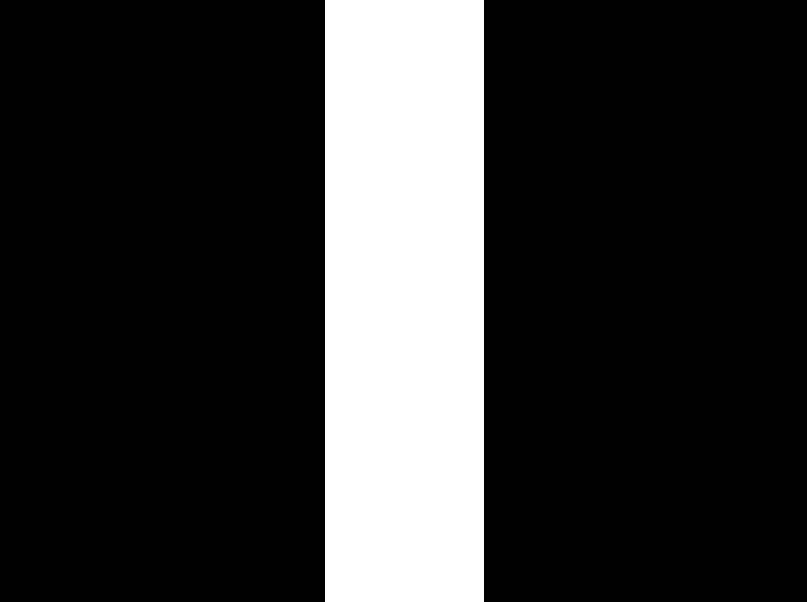
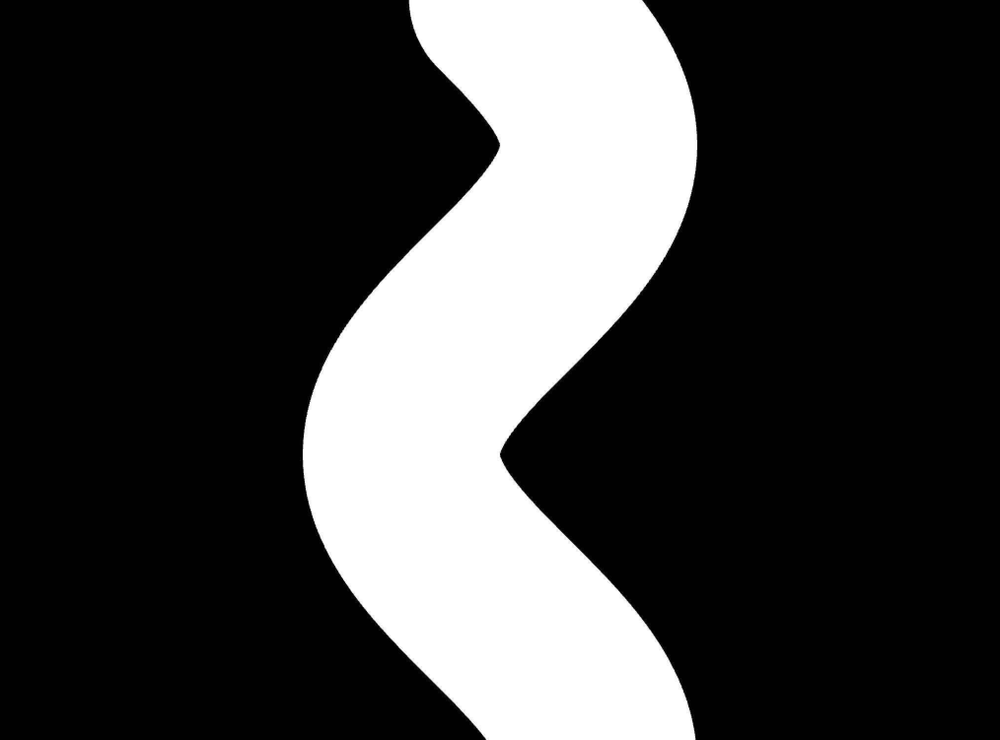
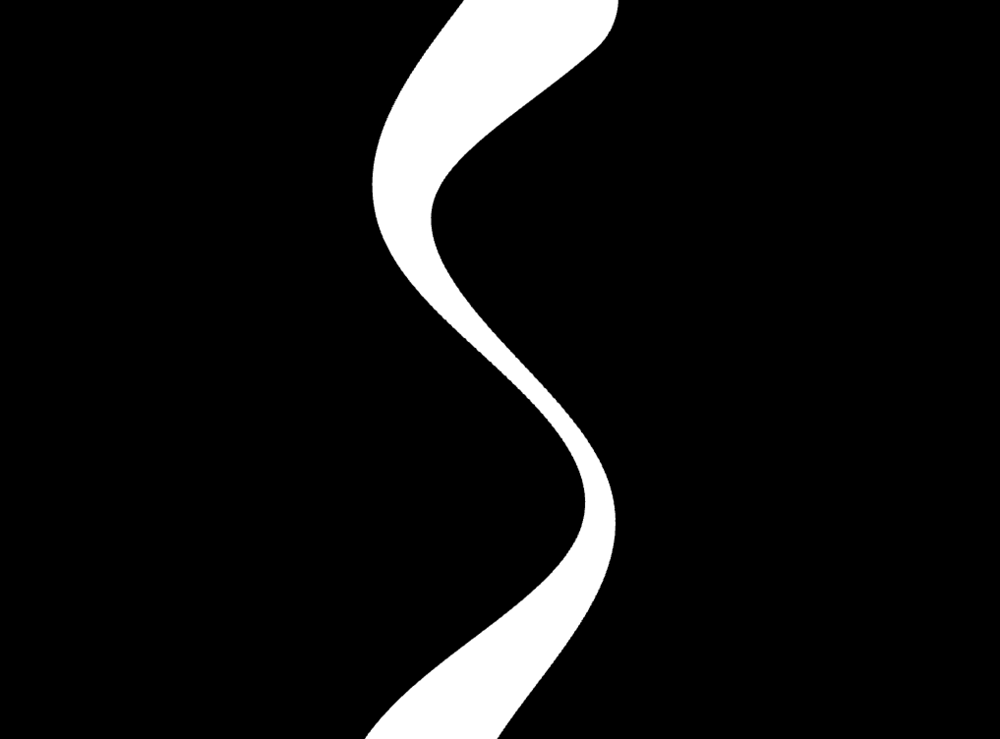
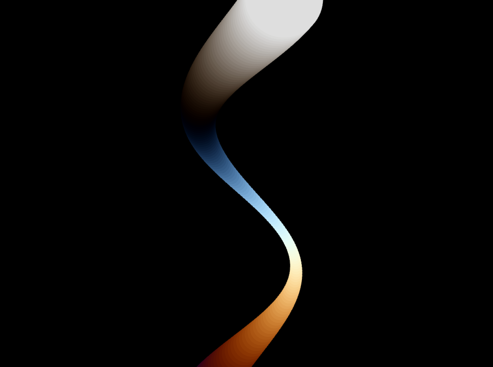
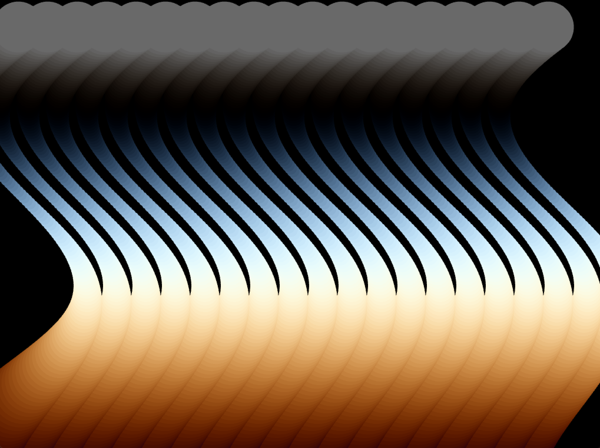
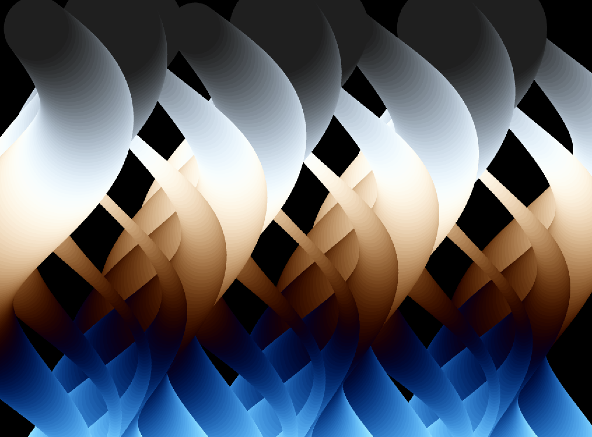
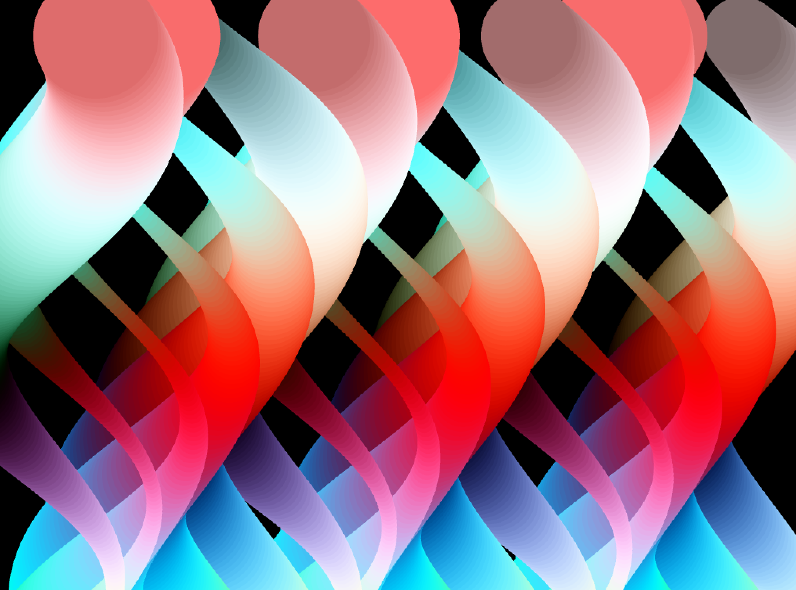

## Generative Sine waves

### References
- https://www.youtube.com/watch?v=kYejiSrzFzs&list=PL6QF0yo3Zj7DbN76C5-_6VCDF5CPBIz6l&index=13
- https://www.youtube.com/watch?v=bmztlO9_Wvo

### Process

**ofApp::setup()**
```
void ofApp::setup(){
    
    ofSetBackgroundColor(0);
    ofSetCircleResolution(100);
    ofSetDepthTest(true);

}
```

**Complete Code**
```
void ofApp::draw(){
    
    float time = ofGetElapsedTimef();
    
    for(int x =1; x<20; x++){ // loads of sine wave lines
    
        for (int i=0; i<900; i+=5){
            // color
            //ofSetColor(127 + 127 * sin(i * 0.01 + time), 127 + 127 * sin(i*0.011 + time), 127 + 127 * sin(i * 0.012 + time));
            
            ofSetColor(127 + 127 * sin(i * 0.01 + time + x), 127 + 127 * sin(i*0.011 + time), 127 + 127 * sin(i * 0.012 + time)); // alter the color with x value as well
            
            //ofDrawCircle(ofGetWidth()/2, i, 100);
            //ofDrawCircle( ofGetWidth()/2 + 100 *sin(i * 0.01 + time), i, 100); // sine wave (video 5:00)
            
            //ofDrawCircle( ofGetWidth()/2 + 100 *sin(i * 0.01 + time), i, 50+40*sin(i*0.005 + time)); // circles change in size (video 5:45)
            
            //ofDrawCircle(50 * x + 100 * sin(i * 0.01 + time), 50 + i, 50 + 40 * sin(i * 0.005 + time));
            
            ofDrawCircle(50 * x + 100 * sin(i * 0.01 + time + x), 50 + i, 50 + 40 * sin(i * 0.005 + time + x)); // add x into time sine value & radius -> change in radius & x position by looping x iteration


        }
    }
    

}
```

**1**
```
void ofApp::draw(){
    
        for (int i=0; i<900; i+=5){
            
            fDrawCircle(ofGetWidth()/2, i, 100);
        }
}
```


**2**
```
ofDrawCircle( ofGetWidth()/2 + 100 *sin(i * 0.01 + time), i, 100);
```
sine wave (video 5:00)



**3**
```
ofDrawCircle( ofGetWidth()/2 + 100 *sin(i * 0.01 + time), i, 50+40*sin(i*0.005 + time)); 
```
circles change in size (video 5:45)



**4**
```
ofSetColor(127 + 127 * sin(i * 0.01 + time), 127 + 127 * sin(i*0.011 + time), 127 + 127 * sin(i * 0.012 + time));
```
adding colors



**5**
```
for(int x =1; x<20; x++){ 
    
        for (int i=0; i<900; i+=5){
            // color
            ofSetColor(127 + 127 * sin(i * 0.01 + time), 127 + 127 * sin(i*0.011 + time), 127 + 127 * sin(i * 0.012 + time));
            
            
            ofDrawCircle(50 * x + 100 * sin(i * 0.01 + time), 50 + i, 50 + 40 * sin(i * 0.005 + time));

        }
    }
```
20 loads of sine wave lines
adding a for loop



**6**
```
ofDrawCircle(50 * x + 100 * sin(i * 0.01 + time + x), 50 + i, 50 + 40 * sin(i * 0.005 + time + x)); 
```
add x into time sine value & radius -> change in radius & x position by looping x iteration



**7**
```
ofSetColor(127 + 127 * sin(i * 0.01 + time + x), 127 + 127 * sin(i*0.011 + time), 127 + 127 * sin(i * 0.012 + time)); 
```
alter the color with x value as well



